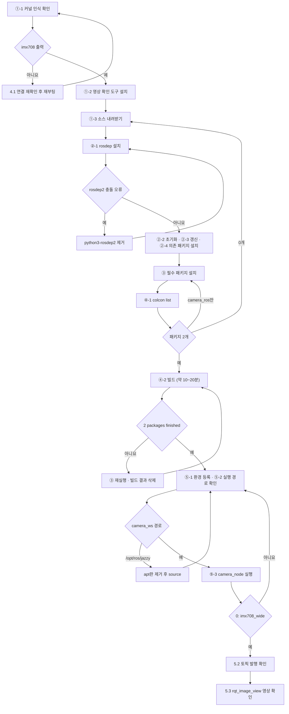

# Day 4 — 카메라와 영상 처리

**2026-09-14 · 한국폴리텍대학교 하이테크과정 ROS2**

이 자료는 수업의 개념 설명과 실습 절차·명령어를 복습용으로 정리한 것입니다. 복습 기준 = 이 자료 + 수업 중 필기.

---

## 목차

1. [오늘의 목표](#1-오늘의-목표)
2. [환경 전환 — PC에서 RPi5로](#2-환경-전환--pc에서-rpi5로)
3. [실습 ① — 원격 연결과 작업물 옮기기](#3-실습--원격-연결과-작업물-옮기기)
4. [카메라와 이미지 토픽](#4-카메라와-이미지-토픽)
5. [실습 ② — 카메라 노드 구동](#5-실습--카메라-노드-구동)
6. [영상 처리의 기초](#6-영상-처리의-기초)
7. [실습 ③ — 색상 검출 노드](#7-실습--색상-검출-노드)
8. [미니프로젝트 — 라인 인식](#8-미니프로젝트--라인-인식)
9. [카메라를 사용할 수 없을 때](#9-카메라를-사용할-수-없을-때)
10. [오늘의 요약](#10-오늘의-요약)
11. [다음 시간](#11-다음-시간)

---

## 1. 오늘의 목표

Day 1~3의 turtlesim은 **좌표가 이미 주어진** 세계였습니다. turtle의 위치는 `/turtle1/pose`로 언제나 정확히 알 수 있었습니다. 실제 로봇에는 그런 토픽이 없습니다. **센서가 전송하는 원본 데이터에서 필요한 정보를 직접 추출해야** 합니다.

| | turtlesim (Day 1~3) | 카메라 (오늘) |
|---|---|---|
| 입력 | `Pose` — x·y·theta가 그대로 | `Image` — 픽셀 값의 배열 |
| 위치 파악 | 구독만으로 확보 | **영상에서 검출** |
| 데이터 크기 | 수십 바이트 | 수십만~수백만 바이트 |
| 오차 | 없음 | 조명·그림자·반사에 따라 변동 |

오늘 완성할 것 — 카메라 영상에서 **특정 색을 찾아 그 위치를 좌표로 출력**하는 노드. 이것이 Day 5(AI 분류)와 Day 6(판단·행동 연결)의 입력이 됩니다.

| 단계 | 장 | 내용 | 산출물 |
|:--:|:--:|------|------|
| ① 전환 | 2·3 | RPi5 원격 연결 → Day 1~3 작업물 옮기기 → 동작 확인 | RPi5에서 실행되는 `my_first_pkg` |
| ② 카메라 | 4·5 | 이미지 토픽 구조 → 카메라 노드 구동 → 영상 확인 | `/camera/image_raw` 발행 |
| ③ 영상 처리 | 6·7 | 색공간·마스킹 → 색상 검출 노드 작성 | `color_tracker` |
| ④ 미니프로젝트 | 8 | 라인 인식 — 영상에서 진행 방향 산출 | `line_follower` |

Day 3까지의 복습:

| 항목 | 내용 |
|------|------|
| 패키지 | `ros2 pkg create --build-type ament_python` → `colcon build` → `source` → `ros2 run` |
| 파라미터 | `declare_parameter` 선언 → `--ros-args -p` 주입 → `param set` 변경 → `dump`로 저장 |
| 커스텀 인터페이스 | `.msg` 직접 정의 — `ament_cmake` 전용 패키지 + `rosidl_generate_interfaces` |
| launch | 여러 노드를 한 명령으로 — `ros2 launch <패키지> <파일>` |
| 미로 자율주행 | 상태 기계(RUN·BACK·TURN)로 벽을 피해 목표에 도달 |

- Day 3까지의 산출물 = `my_first_pkg`(circle_driver·pose_printer·square_driver·maze_driver) + `my_msgs`. **오늘 이 산출물을 RPi5로 옮깁니다**(3장)

### 1.1 준비물 확인

| 품목 | 확인 사항 |
|------|----------|
| **Raspberry Pi 5** | **과제 완료 상태** — ① Ubuntu 24.04 + ROS2 Jazzy 구축 ② **SSH(Secure Shell)·원격 데스크톱(RDP, Remote Desktop Protocol) 연결 설정**(Day 3 자료 11장). 상태는 1.2에서 확인 |
| **CSI(Camera Serial Interface) 카메라 모듈** | **Camera Module 3 Wide**(센서 IMX708) · 케이블 = **Camera Cable Standard–Mini 200mm**(RPi5용 22핀↔15핀) · 접점 면 방향 주의 — **전원을 끈 상태에서 연결** |
| 강의실 PC | RPi5 원격 연결 단말(원격 데스크톱·SSH) |
| 유선 랜 또는 Wi-Fi | RPi5와 PC가 **같은 네트워크** |
| microSD·전원 어댑터 | 5V/5A 권장 |

> **자주 하는 실수 —** CSI 케이블은 전원이 켜진 상태에서 꽂으면 모듈이 손상될 수 있습니다. 반드시 전원을 끄고 연결한 뒤 부팅하십시오.

### 1.2 환경 점검 — 시작 전 10분

오늘은 과제 → 연결 → 카메라 → 코드 → 프로젝트가 직렬로 이어지므로, 자신이 어느 단계에 있는지를 가장 먼저 확인합니다. RPi5에서 실행 — Day 3 자료 11.3과 같은 명령입니다.

```bash
lsb_release -a          # Ubuntu 24.04 확인
ros2 --help             # ROS2 명령 인식 확인
echo $ROS_DISTRO        # jazzy 출력 확인
ros2 topic list         # /parameter_events·/rosout 표시
```

| 결과 | 상태 | 다음 |
|------|------|------|
| 4개 모두 정상 | 정상 | 2장으로 진행 |
| `ros2` 명령 미인식 | 경미 | `.bashrc`에 `source /opt/ros/jazzy/setup.bash` 추가(Day 1 자료) — **즉시 복구 가능** |
| Ubuntu 버전 불일치 | 재설치 필요 | 오늘 중 구축 곤란 — 3.1 |
| 부팅 불가 · 미착수 | 미완 | 3.1 |

- 이 과정은 **개인 단위**로 진행합니다 — 기기를 함께 쓰지 않으며, 미완 상태의 진행 방법은 3.1

---

## 2. 환경 전환 — PC에서 RPi5로

### 2.1 왜 오늘부터 RPi5인가

Day 1~3은 강의실 PC의 WSL2에서 진행했습니다. 오늘부터 RPi5로 옮깁니다.

| 이유 | 내용 |
|------|------|
| **카메라** | 이 과정의 카메라는 **CSI 방식**(플랫 케이블) — **RPi 전용 커넥터**라 PC에는 물리적으로 연결되지 않음 |
| 이후 일정 | Day 8~12 실물 구간은 차량에 실린 RPi5에서 동작(Day 7 SLAM 실습만 PC) — 지금 옮겨 두면 전환이 수월함 |
| 성능 확인 | 영상 처리는 연산 부담이 큼 — **RPi5에서 어느 정도 성능으로 실행되는지**를 지금부터 체감해야 Day 9 설계가 현실적이 됨 |

- 두 환경은 **Ubuntu 24.04 + ROS2 Jazzy로 동일** — 코드를 고칠 필요가 없음. 이것이 Day 1에서 버전을 통일한 이유
- 바뀌는 것은 **어디서 실행되는가**뿐

### 2.2 개발 환경과 실행 환경의 분리

실무의 로봇 개발은 대부분 이 구조입니다.

```
개발 PC (코드 작성·빌드) ──git · scp──▶ 로봇 SBC (실행)
        ▲                                    │
        └──────────── 토픽·로그 ──────────────┘
```

| 역할 | 담당 | 이유 |
|------|------|------|
| 코드 작성·편집 | PC 또는 RPi5 | 화면이 크고 입력이 편한 쪽 |
| **실행** | **로봇 위의 컴퓨터** | 센서·구동부가 물리적으로 거기 붙어 있음 |
| 관찰 | 어느 쪽이든 | **같은 네트워크 안이면** 같은 Domain ID로 PC에서도 토픽이 보임(Day 1 자료) — PC가 WSL2이면 기본 설정에서 보이지 않을 수 있음 |

- 오늘은 **RPi5 하나에서 작성·실행을 모두** 수행 — 구조를 단순하게 유지
- SBC(Single Board Computer) = 한 장의 기판에 CPU·메모리·입출력을 모두 갖춘 소형 컴퓨터 — RPi5가 이에 해당

---

## 3. 실습 ① — 원격 연결과 작업물 옮기기

### 3.1 환경이 준비되지 않았다면

1.2 점검에서 미완으로 확인된 경우의 진행 방법입니다. 미완 상태라도 각자 아래 경로로 오늘 내용을 학습합니다.

| 상태 | 오늘의 진행 |
|------|------|
| 환경 등록 누락 등 경미 | 즉시 복구 후 정상 경로 |
| 재설치 필요 | **구축을 각자 이어서 진행** — 설치가 진행되는 동안 4·6장 이론에는 동일하게 참여 |
| 카메라를 구동하지 못함 | **Day 1~3의 PC 환경(WSL2)에서 7장 코드 작성** — 영상 입력만 `ros2 bag` 재생 또는 이미지 파일로 대체(9장) |

> **오늘 놓치지 말아야 할 것 —** 카메라가 구동되지 않아도 **6장 영상 처리 원리와 7장 노드 코드는 그대로 학습**할 수 있습니다. 환경은 뒤에 복구하면 되지만, 오늘 다루는 처리 절차(HSV → 마스킹 → 무게중심)는 **Day 5·6의 전제**입니다.

- 구축이 늦어진 경우 **다음 시간 전까지 완료** — Day 5는 RPi5 카메라를 전제로 진행합니다

### 3.2 원격 연결 확인

원격 연결 설정도 과제에 포함되어 있습니다. 여기서는 동작만 확인합니다.

| 방식 | 보이는 것 | 쓰는 상황 |
|------|------|------|
| **SSH** | 터미널만 | 명령 실행·파일 편집 — 가볍고 빠름 |
| **원격 데스크톱(RDP)** | **바탕화면 전체** | **기본 방식** — 카메라 영상 창처럼 **창을 띄우는 프로그램**에 필요 |

- Ubuntu 24.04의 원격 데스크톱 기능은 **RDP 방식** — 강의실 PC(Windows)에 기본 포함된 **원격 데스크톱 연결** 프로그램으로 연결하며 별도 설치가 필요하지 않음
- 같은 역할의 다른 방식으로 VNC(Virtual Network Computing)가 있음 — 이 과정은 Ubuntu 기본값인 RDP를 사용

> **핵심 —** 오늘 다루는 영상 확인 도구(`rqt_image_view`)는 창을 띄웁니다. SSH 터미널만으로는 영상이 보이지 않으므로 원격 데스크톱을 기본으로 합니다.

**확인 ① 원격 데스크톱 연결** — 강의실 PC에서:

```
시작 메뉴 → "원격 데스크톱 연결" 실행 (또는 Win+R → mstsc)
→ 컴퓨터: 192.168.0.__ 입력 → 연결
→ RPi5 원격 데스크톱 설정의 사용자 이름·암호 입력 → RPi5 바탕화면 표시
```

- RPi5 바탕화면이 보이면 → ②로 진행
- 원격 데스크톱을 설정하지 않은 상태면 → 아래 **설정**을 수행한 뒤 **①을 다시** 실행
- 연결 자체가 실패하면 → RPi5 주소(`hostname -I` — 재부팅하면 바뀔 수 있음)·같은 네트워크인지 확인 후 **①을 다시** 실행
- 이름·암호 오류가 나오면 → Ubuntu 계정이 아니라 **원격 데스크톱 설정에 표시된** 이름·암호로 **①을 다시** 실행
- 검은 화면이면 → Windows 기본 `mstsc` 사용·RPi5 로그인 상태·화면 잠금 해제 확인 후 **①을 다시** 실행

**확인 ② SSH 연결**:

```bash
ssh 사용자명@192.168.0.__
```

- 암호 입력 후 RPi5 프롬프트가 나오면 → 3.3으로 진행
- `Connection refused`가 나오면 SSH 서버가 없는 상태 → 아래 **설정**의 SSH 설치를 수행한 뒤 **②를 다시** 실행
- 응답 없이 멈추면 → ①과 같이 주소·네트워크를 확인한 뒤 **②를 다시** 실행

**설정 — 미설정 상태에서만** — 과제 안내(Day 3 자료 11장)의 절차를 지금 수행합니다(약 10분):

```bash
sudo apt install openssh-server -y && sudo systemctl enable --now ssh
hostname -I                       # 주소 확인 — 메모할 것
```

설정(Settings) → 시스템(System) → **원격 데스크톱(Remote Desktop)** → **데스크톱 공유** 켬 + **원격 제어** 켬 → 로그인 정보의 사용자 이름·암호 확인 또는 지정

- 이 이름·암호는 **원격 연결 전용** — Ubuntu 로그인 계정과 별도로 설정됨
- 데스크톱 공유는 **RPi5에서 현재 로그인된 화면**을 PC로 전송하는 방식 — RPi5를 로그인한 상태로 둠
- 설정을 마치면 → 진행하던 **① 또는 ②로 돌아가** 다시 실행

### 3.3 작업물 옮기기

Day 1~3에서 만든 패키지를 RPi5로 옮깁니다. 두 가지 방법이 있습니다.

**방법 A — `scp`로 직접 복사** (간단):

```bash
# PC의 WSL 터미널에서 실행
cd ~/ros2_ws/src
scp -r my_first_pkg my_msgs 사용자명@192.168.0.__:~/ros2_ws/src/
```

**방법 B — git 저장소 경유** (권장):

```bash
# PC에서 — 저장소에 올리기
cd ~/ros2_ws/src/my_first_pkg
git init && git add . && git commit -m "day1-3"
git remote add origin <저장소 주소>
git push -u origin main

# RPi5에서 — 내려받기
cd ~/ros2_ws/src
git clone <저장소 주소>
```

| 방법 | 장점 | 한계 |
|------|------|------|
| A `scp` | 즉시 가능·설정 불요 | 이력이 남지 않음 · 매번 전체 복사 |
| **B git** | **변경 이력·되돌리기 가능** · 이후 수정분만 반영 | 저장소 계정 필요 |

- `scp` = SSH 경로로 파일을 복사하는 명령(`-r` = 폴더 전체)
- 이 과정의 배포도 git 저장소를 사용 — **오늘 이후 예제 코드는 저장소로 제공**
- Day 8~9에서 코드를 자주 고치게 되므로 **B를 익혀 두면 그때 시간을 아낍니다**

### 3.4 RPi5에서 빌드·실행

옮긴 뒤 **다시 빌드**해야 합니다. 빌드 결과물(`build`·`install`)은 기기에 종속되므로 복사해 오지 않습니다.

```bash
cd ~/ros2_ws
colcon build
source install/local_setup.bash
ros2 run my_first_pkg circle_driver     # Day 2 산출물이 그대로 동작
```

```bash
# 다른 터미널
ros2 run turtlesim turtlesim_node
```

관찰 — turtle이 원을 그리면 작업물이 정상적으로 옮겨진 것입니다.

| 확인 명령 | 보는 것 |
|------|------|
| `ros2 node list` | 노드가 RPi5에서 실행 중 |
| `ros2 topic hz /turtle1/cmd_vel` | **발행 주기** — PC와 비교해 차이가 있는지 |
| `rqt_graph` | 연결 구조 (원격 데스크톱 화면에서) |

> **Tip —** `scp`로 옮겼다면 `build`·`install`·`log` 폴더가 함께 복사되었을 수 있습니다. 지우고 다시 빌드하십시오.
>
> ```bash
> cd ~/ros2_ws && rm -rf build install log && colcon build
> ```

- **성능 비교** — 같은 코드가 PC와 RPi5에서 얼마나 다른 성능으로 실행되는지 `topic hz`로 확인. Day 9 실물 설계의 근거가 됨
- RPi5에도 **colcon이 설치되어 있어야** 합니다(Day 3 자료 3.0 — `which colcon`으로 확인)

---

## 4. 카메라와 이미지 토픽

### 4.1 카메라 연결 방식

| 방식 | 연결 | 이 과정 |
|------|------|:--:|
| **CSI** | 전용 플랫 케이블 — RPi 보드의 카메라 커넥터 | ✅ 사용 |
| USB (UVC, USB Video Class) | USB 포트 — 일반 웹캠 | — |

- CSI는 **RPi 전용 규격** — 전송 대역이 넓고 지연이 짧지만 다른 컴퓨터에 꽂을 수 없음. 이것이 오늘부터 RPi5를 쓰는 이유(2.1)

케이블 규격 확인 — 연결 전에 먼저 확인합니다.

| 구분 | 커넥터 |
|------|------|
| RPi5 보드 | **22핀·0.5mm 간격 소형 커넥터** 2개 — 보드 표시 `CAM/DISP0`·`CAM/DISP1` |
| 카메라 모듈 | 15핀·1mm 간격 표준 커넥터 |
| 필요한 케이블 | **RPi5용 22핀↔15핀 카메라 변환 케이블** — 이 과정 = Camera Cable Standard–Mini 200mm |

- 카메라 모듈에 함께 들어 있는 15핀↔15핀 케이블은 **RPi5에 끼울 수 없음**
- 디스플레이용 케이블과 카메라용 케이블은 서로 바꿔 쓰지 않음
- 연결한 커넥터 번호(`CAM/DISP0` 또는 `CAM/DISP1`)를 기억 — 인식되지 않아 교수에게 알릴 때 함께 전달

연결 절차 — 전원을 끈 상태에서:

1. 카메라 커넥터의 검은 고정 클립을 위로 당김
2. 플랫 케이블의 **접점 면이 보드 안쪽**을 향하도록 삽입
3. 클립을 눌러 고정 → 전원 인가·부팅

인식 확인 — 커널이 카메라를 인식했는지 먼저 확인합니다:

```bash
sudo dmesg | grep -i imx708            # imx708이 보이면 커널이 카메라를 인식한 것
ls /dev/media* /dev/video*             # 카메라 장치 파일 생성 확인
```

- `imx708`(Camera Module 3 Wide의 센서 이름)이 포함된 줄이 나오면 → 4.2로 진행
- 아무것도 나오지 않으면 → 전원을 끄고 연결 절차 1~3(케이블 규격·방향·클립)을 다시 확인 → 부팅 후 **인식 확인을 다시** 실행
- 연결을 다시 확인해도 나오지 않으면 → `/boot/firmware/config.txt`는 직접 편집하지 않고 **교수에게 알림**(편집 후 재부팅에서 터미널이 실행되지 않은 사례가 있음)
- 카메라는 저장 장치가 아니므로 마운트 작업이 없음 — 드라이버가 인식하면 장치 파일이 자동으로 생성됨
- 이 명령은 5.3 **카메라 동작 확인 5단계**의 1단계 — 2단계부터는 5.1 소스 빌드 후 수행

> **자주 하는 실수**
>
> - **15핀 케이블을 RPi5에 끼우려 함** — 규격이 달라 연결되지 않음. 변환 케이블 사용
> - **케이블 방향 반대** — 인식되지 않음. 접점 면 방향을 다시 확인
> - **전원 인가 상태에서 착탈** — 모듈 손상 위험
> - 클립을 덜 눌러 접촉 불량 — 흔들면 인식이 끊김

### 4.2 이미지 토픽의 구조

카메라 노드는 영상을 **토픽으로 발행**합니다. 형식은 `sensor_msgs/msg/Image`입니다.

```bash
ros2 interface show sensor_msgs/msg/Image
```

```
std_msgs/Header header       # 언제·어느 좌표계 (Day 2 자료 Header)
uint32 height                # 세로 픽셀 수
uint32 width                 # 가로 픽셀 수
string encoding              # 픽셀 표현 방식 — 예: rgb8, bgr8
uint8 is_bigendian
uint32 step                  # 한 줄의 바이트 수
uint8[] data                 # ← 픽셀 값 전체 (배열형)
```

| 필드 | 의미 |
|------|------|
| `header` | **Day 2에서 배운 Header** — `stamp`(촬영 시각)·`frame_id`(카메라 좌표계) |
| `height`·`width` | 해상도 |
| `encoding` | 한 픽셀을 어떻게 표현하는가 — `bgr8` = 파랑·초록·빨강 각 8비트 |
| **`data`** | **Day 2의 배열형** — 픽셀 값이 한 줄로 늘어선 형태 |

**크기 계산** — 640×480 컬러 영상 한 장:

```
640 × 480 × 3(BGR) = 921,600 바이트 ≈ 0.9 MB
30Hz로 발행하면 초당 약 27 MB
```

| 토픽 | 한 건 크기 | 비교 |
|------|:--:|------|
| `Twist` (속도 명령) | 48 바이트 | 기준 |
| `Pose` (위치) | 20 바이트 | 더 작음 |
| **`Image` (640×480)** | **약 920,000 바이트** | **약 2만 배** |

- 그래서 이미지 토픽에는 **QoS(Quality of Service) `BEST_EFFORT`**(Day 2 자료)가 기본 — 한 장 놓쳐도 다음 장이 곧 오므로 재전송이 무의미
- `topic echo`로 이미지를 그대로 출력하면 화면이 숫자로 뒤덮이므로 **전용 뷰어**를 씁니다(5.3)

### 4.3 카메라 좌표계 — 부호 반전의 원인

Day 1 표준 좌표계에서 예고한 지점입니다.

| 대상 | 기본 좌표계 |
|------|------|
| 로봇 | x 전방 · y **좌측** · z 상방 |
| 카메라(영상) | **x 우측** · y 하방 · z 전방 |

영상에서 픽셀 위치는 **왼쪽 위가 원점**이고 x는 오른쪽, y는 아래로 증가합니다.

```
(0,0) ────────────► x (오른쪽)
  │
  │      · (320, 240)  ← 화면 중앙
  │
  ▼ y (아래)
```

> **자주 하는 실수 —** 대상이 화면 **오른쪽**에 있으면 영상 좌표 x가 **큽니다.** 그런데 로봇을 그쪽으로 돌리려면 **`angular.z`는 음수**여야 합니다(오른손 법칙 — Day 1). **부호를 뒤집지 않으면 대상에서 멀어지는 방향으로 회전합니다.** 8.2에서 실제로 다룹니다.

---

## 5. 실습 ② — 카메라 노드 구동

진행 흐름 — 확인 결과가 맞지 않으면 화살표를 따라 돌아가 다시 실행합니다.



### 5.1 카메라 스택 설치 — 소스 빌드

RPi5의 CSI 카메라는 **libcamera**라는 라이브러리로 다룹니다. ROS2와 연결하는 패키지가 `camera_ros`입니다.

> **이 과정의 카메라 주의 —** apt로 설치되는 libcamera는 **원본(upstream) 판**입니다. Camera Module 3(IMX708)을 RPi5에서 처리하는 Raspberry Pi 전용 구성 요소가 없어 카메라 노드가 `no cameras available`을 출력합니다. 따라서 **Raspberry Pi판 libcamera와 `camera_ros`를 소스에서 빌드**합니다.

| 구성 | 역할 |
|------|------|
| `raspberrypi/libcamera` | RPi5 카메라 처리 구성 요소를 포함한 libcamera — apt 원본 판을 대신함 |
| `camera_ros` | libcamera 영상을 `/camera/image_raw` 토픽으로 발행 |

설치 순서:

| 순서 | 내용 |
|:--:|------|
| ① 준비 | ①-1 커널 인식 확인 · ①-2 영상 확인 도구 설치 · ①-3 소스 내려받기 |
| ② 의존성 설치 | ②-1 rosdep 설치 · ②-2 초기화 · ②-3 갱신 · ②-4 의존 패키지 설치 |
| ③ 필수 패키지 설치 | libcamera 빌드 도구·라이브러리 설치 |
| ④ 빌드 | ④-1 빌드 대상 확인 · ④-2 빌드(약 10~20분, 실측 10분 38초) |
| ⑤ 빌드 후 확인 | ⑤-1 환경 등록 · ⑤-2 실행 경로 확인 · ⑤-3 카메라 노드 실행 |

- 각 단계는 **실행 → 확인 → 결과에 따른 조치** 순서 — 조치 뒤에 적힌 단계로 돌아가 이어서 진행
- ④-2 빌드가 진행되는 동안 4·6장 이론을 읽어 둡니다

**①-1 커널 인식 확인**

```bash
sudo dmesg | grep -i imx708
```

- `imx708`이 포함된 줄이 나오면 → ①-2로 진행
- 아무것도 나오지 않으면 → 전원을 끄고 4.1 연결 절차를 다시 확인한 뒤 부팅해 **①-1을 다시** 실행
- 재부팅 후에도 나오지 않으면 → 교수에게 알림

**①-2 영상 확인 도구 설치**

```bash
sudo apt update
sudo apt install -y git ros-jazzy-rqt-image-view ros-jazzy-image-tools
```

- 오류 없이 끝나면 → ①-3으로 진행
- apt판 `ros-jazzy-camera-ros`·`libcamera-tools`는 설치하지 않음(빌드한 판과 혼동 방지) — 이미 설치했다면 아래 명령으로 제거한 뒤 ①-3으로 진행

```bash
sudo apt remove -y ros-jazzy-camera-ros libcamera-tools
```

**①-3 작업 공간 만들기·소스 내려받기**

```bash
source /opt/ros/jazzy/setup.bash
mkdir -p ~/camera_ws/src && cd ~/camera_ws/src
git clone https://github.com/raspberrypi/libcamera.git
git clone https://github.com/christianrauch/camera_ros.git
```

- `ls ~/camera_ws/src`에 `libcamera`·`camera_ros` 두 폴더가 보이면 → ②-1로 진행
- `already exists` 오류가 나오면 이미 내려받은 상태 → ②-1로 진행
- 네트워크 오류로 중단되면 → 연결을 확인하고 **실패한 `git clone` 줄만 다시** 실행
- `~/camera_ws`는 `~/ros2_ws`와 분리한 작업 공간 — 이후 `~/ros2_ws` 빌드 때 libcamera를 다시 빌드하지 않음

**②-1 rosdep 설치**

```bash
sudo apt install -y python3-rosdep
```

- 오류 없이 끝나면 → ②-2로 진행
- `python3-rosdep2`와 충돌한다는 오류가 나오면 → 아래 명령을 실행하고 **②-1을 다시** 실행(수업 중 발생)

```bash
sudo apt remove -y python3-rosdep2
```

- Ubuntu 저장소의 `python3-rosdep2`와 ROS 저장소의 `python3-rosdep`은 함께 설치되지 않음

**②-2 rosdep 초기화** (RPi5마다 최초 1회)

```bash
sudo rosdep init
```

- 완료 메시지가 나오면 → ②-3으로 진행
- `already exists` 오류가 나오면 이미 초기화된 상태 → 그대로 ②-3으로 진행

**②-3 목록 갱신**

```bash
rosdep update
```

- 오류 없이 끝나면 → ②-4로 진행
- 네트워크 오류로 중단되면 → 연결을 확인하고 **②-3을 다시** 실행

**②-4 의존 패키지 설치**

```bash
source /opt/ros/jazzy/setup.bash
cd ~/camera_ws
rosdep install -y --from-paths src --ignore-src --rosdistro jazzy --skip-keys=libcamera
```

- `All required rosdeps installed successfully`가 나오면 → ③으로 진행
- `rosdep: command not found`가 나오면 ②-1이 끝나지 않은 상태 → **②-1부터 다시** 진행
- `--skip-keys=libcamera` = apt의 libcamera를 설치하지 않고 ①-3에서 내려받은 소스를 사용

**③ 필수 패키지 설치** — ② 이후에도 libcamera 빌드 도구는 빠져 있을 수 있어 직접 설치합니다

```bash
sudo apt install -y python3-colcon-meson meson ninja-build pkg-config \
  libyaml-dev python3-yaml python3-ply python3-jinja2 \
  libssl-dev libevent-dev libudev-dev
```

| 패키지 | 용도 |
|------|------|
| `python3-colcon-meson` · `meson` · `ninja-build` · `pkg-config` | 빌드 도구 |
| `libyaml-dev` · `python3-yaml` · `python3-ply` · `python3-jinja2` | libcamera 필수 라이브러리 |
| `libssl-dev` · `libevent-dev` · `libudev-dev` | 모듈 서명 · 이벤트 처리 · 장치 탐지 |

- 오류 없이 끝나면 → ④-1로 진행
- ⚠️ 이 단계를 빠뜨리면 ④-2 빌드가 **수 초 만에 실패**(실측 — libcamera 12.4초)

**④-1 빌드 대상 확인**

```bash
cd ~/camera_ws
colcon list
```

- `camera_ros`·`libcamera` 2개가 나오면 → ④-2로 진행
- 아무것도 나오지 않으면 소스가 없거나 위치가 다른 상태 → **①-3부터 다시** 진행
- `camera_ros`만 나오면 libcamera를 읽는 빌드 도구가 없는 상태 → **③을 다시** 실행하고 ④-1로 돌아옴

**④-2 빌드**

```bash
colcon build --event-handlers=console_direct+
```

- RPi5에서 **약 10~20분**(실측 10분 38초)
- 마지막 줄이 `Summary: 2 packages finished`이면 → ⑤-1로 진행
- `Failed`가 나오면 → **③을 다시** 실행하고, 아래 명령으로 빌드 결과를 지운 뒤 **④-2를 다시** 실행

```bash
cd ~/camera_ws && rm -rf build install log    # 빌드 결과만 삭제 — src는 유지
```

- 같은 실패가 반복되면 → `~/camera_ws/log/latest_build/libcamera/stderr.log` 마지막 부분을 교수에게 전달

**⑤-1 환경 등록**

```bash
echo "source ~/camera_ws/install/setup.bash" >> ~/.bashrc   # 새 터미널에도 적용
source ~/camera_ws/install/setup.bash
```

- 오류 없이 끝나면 → ⑤-2로 진행
- `No such file or directory`가 나오면 빌드가 끝나지 않은 상태 → **④-2로 돌아가** 완료 줄을 확인

**⑤-2 실행 경로 확인**

```bash
ros2 pkg prefix camera_ros
```

- `/home/<사용자>/camera_ws/install/camera_ros`가 나오면 → ⑤-3으로 진행
- `/opt/ros/jazzy`가 나오면 apt판이 실행되는 상태(원본 판 libcamera라 이 카메라를 인식하지 못함) → 아래 명령으로 제거하고 ⑤-1의 `source` 줄을 실행한 뒤 **⑤-2를 다시** 실행

```bash
sudo apt remove -y ros-jazzy-camera-ros
```

- `Package not found`가 나오면 환경 등록이 적용되지 않은 상태 → **⑤-1을 다시** 실행

**⑤-3 카메라 노드 실행**

```bash
ros2 run camera_ros camera_node
```

- 로그에 `0: imx708_wide`가 나오면 → 설치 완료. `Ctrl+C`로 종료하고 5.2로 진행
- `no cameras available`이 나오면 → `Ctrl+C`로 종료하고 **⑤-2를 다시** 실행
- ⑤-2가 `camera_ws` 경로인데도 같은 메시지가 나오면 → `groups` 출력에 `video`가 있는지 확인. 없으면 `sudo usermod -aG video $USER` 실행 후 재로그인하고 **⑤-3을 다시** 실행
- `video`가 있어도 같으면 → **①-1을 다시** 실행해 커널 인식을 확인 → 그래도 같으면 교수에게 알림
- 경고가 여러 줄 섞여 나오는 것은 정상 — 의미는 5.2 실행 로그 읽기

> **여기서 실패하면 이후 진행이 막힙니다 —** 카메라 스택이 구동되지 않으면 6장 이후가 전부 막힙니다. 위 조치를 끝까지 수행해도 구동되지 않으면 교수 안내에 따라 **9장 카메라를 사용할 수 없을 때**로 넘어갑니다.

### 5.2 카메라 노드 실행

```bash
ros2 run camera_ros camera_node
```

```bash
# 다른 터미널
ros2 topic list                       # /camera/image_raw 등장 확인
ros2 topic hz /camera/image_raw       # 발행 주기 (Day 1)
ros2 topic bw /camera/image_raw       # 대역폭 — MB 단위가 나옴
```

| 관찰 항목 | 예상 |
|------|------|
| `topic list` | `/camera/image_raw`·`/camera/camera_info` |
| `topic hz` | 약 30Hz(설정에 따라 변동) |
| **`topic bw`** | **수십 MB/s** — 4.2에서 계산한 값과 대조 |

- `topic bw`를 여기서 쓰는 이유 — Day 1에서 명령만 배웠던 것이 **실제로 의미를 갖는 첫 지점**
- 이미지 토픽은 `topic echo`로 출력하지 않음 — 픽셀 값 배열이 화면을 채움
- 해상도를 낮추면 부담이 줄어듦:

```bash
ros2 run camera_ros camera_node --ros-args -p width:=640 -p height:=480
```

- 파라미터 주입 방식은 Day 3 자료 5.4와 동일 — **표준 문법이 그대로 적용됨**

실행 로그 읽기 — 정상 표시와 무시해도 되는 경고:

| 로그 | 의미 |
|------|------|
| `libcamera v0.7.2+rpt…` · `rpi/pisp` | 빌드한 Raspberry Pi판 libcamera 사용 중 — 정상 |
| `cameras: 0: imx708_wide` · `configured with 800x600` | 카메라 인식·설정 완료 — 정상 |
| `no camera / pixel format / dimensions selected` | 파라미터를 주지 않아 기본값으로 시작했다는 안내 |
| `Camera calibration file … not found` | 렌즈 보정 파일 없음 — 영상 출력에는 영향 없음 |
| `No static properties available for 'imx708_wide'` | 센서 부가 정보 안내 — 동작 영향 없음 |
| `AfWindows` · `AF_TRIGGER` · `AF_PAUSE` | 자동초점 설정 미적용 안내 |

### 5.3 영상 확인

```bash
ros2 run rqt_image_view rqt_image_view
```

- 창이 뜨면 좌측 상단에서 `/camera/image_raw` 선택 → 영상 표시
- 원격 데스크톱으로 연결했으므로 이 창이 PC 화면에 보임(3.2)

| 도구 | 용도 |
|------|------|
| `rqt_image_view` | **이미지 토픽 전용 뷰어** — 토픽을 골라 영상으로 표시 |
| `rqt_graph` | 카메라 노드와 구독자의 연결 확인 |
| `topic hz`·`bw` | 수치로 확인 |

> **Tip —** 영상이 끊기거나 지연이 크면 **해상도를 먼저 낮춥니다.** 원격 데스크톱은 화면 전체를 네트워크로 보내므로, 영상 창이 크면 그만큼 느려집니다.

- 확인 지점 — **카메라 → 토픽 → 뷰어**의 경로가 성립. 이 사이에 우리 노드를 끼워 넣는 것이 7장

**카메라 동작 확인 — 5단계**

앞 단계가 성립해야 다음 단계로 넘어갑니다. 정상이 아니면 "아니면" 열의 조치를 실행하고 적힌 단계부터 다시 확인합니다.

| 단계 | 명령 | 정상 | 아니면 |
|:--:|------|------|------|
| 1 커널 인식 | `sudo dmesg \| grep -i imx708` | `imx708` 출력 | 5.1 ①-1 조치 → 1 다시 |
| 2 스택 빌드 | `ros2 pkg prefix camera_ros` | `camera_ws` 경로 | 5.1 ⑤-2 조치 → 2 다시 |
| 3 ROS 카메라 | `ros2 run camera_ros camera_node` | `0: imx708_wide` | 2부터 다시 |
| 4 토픽 발행 | `ros2 topic hz /camera/image_raw` | 약 30Hz | 4 조치(아래) → 4 다시 |
| 5 최종 검증 | `rqt_image_view` → `/camera/image_raw` | 영상·움직임 반영 | 5 조치(아래) → 5 다시 |

- 4 조치 = 3의 노드가 실행 중인지 확인 · 두 터미널의 `echo $ROS_DOMAIN_ID` 값이 같은지 확인
- 5 조치 = SSH가 아닌 원격 데스크톱 화면에서 실행했는지(3.2) · 좌측 상단에서 `/camera/image_raw`를 선택했는지 확인 · 영상이 끊기거나 느리면 해상도를 640×480으로 낮춤(5.2)

---

## 6. 영상 처리의 기초

### 6.1 픽셀에서 좌표로

영상은 숫자의 배열일 뿐입니다. "빨간 공이 어디 있는가"를 알려면 **숫자에서 위치를 추출하는 절차**가 필요합니다.

```
원본 영상(BGR) ──▶ 색공간 변환(HSV) ──▶ 마스킹(범위 내 = 흰색) ──▶ 잡음 제거(모폴로지) ──▶ 무게중심(좌표 산출)
```

| 단계 | 하는 일 | 결과 |
|:--:|------|------|
| ① 변환 | BGR → HSV | 색을 다루기 쉬운 형태로 |
| ② 마스킹 | 지정 색 범위만 남김 | **흑백 영상**(대상 = 흰색) |
| ③ 잡음 제거 | 작은 점 제거 | 깔끔한 덩어리 |
| ④ 좌표 산출 | 흰 영역의 중심 계산 | **(x, y) 숫자** |

- ④의 결과가 **토픽으로 발행할 값** — 여기서부터 다시 ROS2의 영역

### 6.2 왜 HSV인가

| 색공간 | 구성 | 성질 |
|------|------|------|
| **BGR**(Blue·Green·Red) | 파랑·초록·빨강의 세기 | 조명이 바뀌면 **세 값이 모두 변함** |
| **HSV**(Hue·Saturation·Value) | **H**(색상)·**S**(채도)·**V**(명도) | 조명이 바뀌어도 **H는 비교적 유지됨** |

빨간 공을 예로 들면:

| 조건 | BGR | HSV |
|------|------|------|
| 밝은 곳 | (30, 30, 220) | H≈0, S≈220, **V≈220** |
| 그늘 | (15, 15, 110) | H≈0, S≈220, **V≈110** |

- BGR에서는 세 값이 모두 절반이 되어 **같은 색으로 보기 어렵습니다**
- HSV에서는 **H(색상)가 그대로** — "빨강"이라는 판단이 유지됨
- 그래서 색으로 대상을 찾을 때는 **HSV로 변환한 뒤 H 범위로 거릅니다**

**H 값의 범위** (OpenCV 기준 0~179):

| 색 | H 대략값 |
|------|:--:|
| 빨강 | 0~10 · 170~179 (두 구간으로 나뉨) |
| 노랑 | 20~35 |
| 초록 | 40~80 |
| 파랑 | 90~130 |

> **자주 하는 실수 —** 빨강은 H 범위가 양끝 두 구간으로 나뉩니다. 한 범위만 쓰면 절반을 놓치므로 두 범위를 만들어 합쳐야 합니다. 실습에서는 이 문제가 없는 **초록·파랑을 권장**합니다.

### 6.3 잡음 제거 — 모폴로지

마스킹 결과에는 작은 흰 점이 섞입니다. 반사·그림자 때문입니다.

| 연산 | 하는 일 | 쓰는 때 |
|------|------|------|
| **침식**(erode) | 흰 영역을 깎음 | 작은 점 제거 |
| **팽창**(dilate) | 흰 영역을 불림 | 깎인 본체 복원 |
| **열림**(opening) | 침식 → 팽창 | **작은 점만 없애고 본체는 유지** — 주로 사용 |

- 실습에서는 `cv2.morphologyEx(mask, cv2.MORPH_OPEN, kernel)` 한 줄로 처리
- 커널 크기가 크면 강하게 제거되지만 **작은 대상도 함께 사라짐**

### 6.4 무게중심 계산

흰 영역의 중심을 구하는 방법은 **모멘트**를 쓰는 것이 표준입니다.

```
cx = M['m10'] / M['m00']
cy = M['m01'] / M['m00']
```

| 기호 | 의미 |
|------|------|
| `M` | `cv2.moments(mask)`가 반환한 **딕셔너리** — 아래 키(문자열)로 각 값을 읽음 |
| `m00` | 흰 픽셀의 **총 개수**(면적) |
| `m10` | x좌표의 합 |
| `m01` | y좌표의 합 |

- `m00`이 0이면 **대상이 화면에 없음** — 나눗셈 전에 반드시 확인
- 면적(`m00`)은 **거리 추정에도 쓰임** — 가까울수록 커짐(8장 미니프로젝트)

---

## 7. 실습 ③ — 색상 검출 노드

### 7.1 cv_bridge — ROS2와 OpenCV의 연결

ROS2의 `Image` 메시지와 OpenCV의 이미지 형식은 다릅니다. **`cv_bridge`**가 둘을 변환합니다.

```bash
sudo apt install -y ros-jazzy-cv-bridge python3-opencv
```

| 방향 | 함수 |
|------|------|
| ROS2 → OpenCV | `bridge.imgmsg_to_cv2(msg, 'bgr8')` |
| OpenCV → ROS2 | `bridge.cv2_to_imgmsg(frame, 'bgr8')` |

- `'bgr8'` = 변환 후 형식 지정. OpenCV의 기본 순서가 **BGR**이므로 이 값을 사용

### 7.2 노드 설계

| 항목 | 내용 |
|------|------|
| 노드 이름 | `color_tracker` |
| 구독 | `/camera/image_raw` (`sensor_msgs/msg/Image`) |
| 발행 | `/target_point` (`geometry_msgs/msg/Point`) — 검출 좌표 |
| 파라미터 | `h_min`·`h_max`·`s_min`·`v_min` — 색 범위를 밖에서 조정 |
| 동작 | 영상 수신 → HSV 변환 → 마스킹 → 열림 → 무게중심 → 발행 |

- 좌표 전달에 `Point`를 쓰는 이유 — x·y·z 세 실수를 담는 **표준 타입**이라 커스텀 정의가 불필요
- 파라미터로 색 범위를 빼는 이유 — **조명이 바뀌면 값을 다시 맞춰야 함**(Day 3 자료 5.1)

### 7.3 코드 작성

`~/ros2_ws/src/my_first_pkg/my_first_pkg/color_tracker.py`:

```python
import rclpy
from rclpy.node import Node
from sensor_msgs.msg import Image
from geometry_msgs.msg import Point
from cv_bridge import CvBridge
import cv2
import numpy as np

class ColorTracker(Node):
    def __init__(self):
        super().__init__('color_tracker')
        self.bridge = CvBridge()                                  # ① 변환기

        self.declare_parameter('h_min', 40)                       # ② 색 범위 파라미터
        self.declare_parameter('h_max', 80)
        self.declare_parameter('s_min', 80)
        self.declare_parameter('v_min', 60)

        self.sub = self.create_subscription(                      # ③ 영상 구독
            Image, '/camera/image_raw', self.on_image, 10)
        self.pub = self.create_publisher(Point, '/target_point', 10)
        self.get_logger().info('color_tracker started')

    def on_image(self, msg):
        frame = self.bridge.imgmsg_to_cv2(msg, 'bgr8')            # ④ ROS2 → OpenCV
        hsv = cv2.cvtColor(frame, cv2.COLOR_BGR2HSV)              # ⑤ 색공간 변환

        h_min = self.get_parameter('h_min').value
        h_max = self.get_parameter('h_max').value
        s_min = self.get_parameter('s_min').value
        v_min = self.get_parameter('v_min').value

        lower = np.array([h_min, s_min, v_min])                   # ⑥ 마스킹
        upper = np.array([h_max, 255, 255])
        mask = cv2.inRange(hsv, lower, upper)

        kernel = np.ones((5, 5), np.uint8)                        # ⑦ 잡음 제거
        mask = cv2.morphologyEx(mask, cv2.MORPH_OPEN, kernel)

        m = cv2.moments(mask)                                     # ⑧ 무게중심
        point = Point()
        if m['m00'] > 500:                                        # ⑨ 대상 존재 판정
            point.x = m['m10'] / m['m00']
            point.y = m['m01'] / m['m00']
            point.z = m['m00']                                    # 면적 = 거리의 단서
        else:
            point.x, point.y, point.z = -1.0, -1.0, 0.0           # 미검출 표시

        self.pub.publish(point)

def main(args=None):
    rclpy.init(args=args)
    node = ColorTracker()
    try:
        rclpy.spin(node)
    except KeyboardInterrupt:
        pass
    finally:
        node.destroy_node()
        rclpy.shutdown()
```

| # | 하는 일 |
|:--:|------|
| ① | `CvBridge` 생성 — ROS2 ↔ OpenCV 변환기 |
| ② | 색 범위를 **파라미터로 선언**(Day 3 자료 5.3) — 조명이 바뀌면 코드 수정 없이 조정 |
| ③ | 이미지 토픽 구독 — 구조는 Day 2 구독 스크립트와 동일 |
| ④ | 메시지를 OpenCV 이미지로 변환 |
| ⑤~⑦ | 6장의 절차를 코드로 — 변환 → 마스킹 → 잡음 제거 |
| ⑧ | 무게중심 계산(6.4) |
| ⑨ | **면적이 500 미만이면 미검출로 판정** — 작은 잡음을 대상으로 오인하지 않기 위함 |

**코드 읽기 — Python 문법**

| 코드 | 뜻 |
|------|------|
| `from sensor_msgs.msg import Image` | 모듈에서 이름 하나만 가져오기 — Day 2 자료 import 2형태 |
| `class ColorTracker(Node):` | 괄호 = 상속 — `Node`를 상속받아 만든 새 클래스 |
| `def __init__(self):` | 객체를 만들 때 한 번 실행되는 초기화 메서드 |
| `super().__init__('color_tracker')` | 부모(`Node`)의 초기화를 먼저 실행 — 노드 이름 등록 |
| `self.bridge = CvBridge()` | `self.` = 이 객체의 변수 — 다른 메서드(`on_image`)에서도 같은 값 사용 |
| `def on_image(self, msg):` | 구독 콜백 메서드 — `msg`에 수신한 `Image`가 전달됨 |
| `self.get_parameter('h_min').value` | 점 연결 — 메서드가 반환한 객체의 `.value` 속성을 이어서 읽음 |
| `np.array([h_min, s_min, v_min])` | 리스트(대괄호)를 NumPy 배열로 변환 — OpenCV 함수의 입력 형식 |
| `np.ones((5, 5), np.uint8)` | 괄호 안 괄호 `(5, 5)` = 튜플 하나 — 배열 크기를 한 인자로 전달 |
| `m['m00']` | 딕셔너리 키 접근 — `cv2.moments()`가 반환한 딕셔너리 |
| `if m['m00'] > 500:` … `else:` | 조건 분기 — 들여쓰기가 같은 줄까지가 한 블록 |
| `point.x, point.y, point.z = -1.0, -1.0, 0.0` | 동시 대입 — 왼쪽 세 곳에 오른쪽 세 값을 순서대로 |
| `try:` … `except KeyboardInterrupt:` … `finally:` | Ctrl+C로 종료해도 `finally`의 정리 코드는 반드시 실행(Day 2 노드와 동일) |
| `def main(args=None):` | 기본값 인자 — 호출 시 값을 주지 않으면 `None` |

- 이 표의 항목은 Day 5·6·8·9의 모든 노드 코드에 **같은 형태로 반복**됩니다 — **이후 Day의 자료에도 같은 표를 다시 싣습니다.** 지금 전부 암기할 필요는 없으며, 코드를 읽을 때마다 표를 참조하며 확인하십시오

`setup.py`에 등록(Day 3 자료 4.2와 동일):

```python
'console_scripts': [
    ...
    'color_tracker = my_first_pkg.color_tracker:main',
],
```

### 7.4 실행과 관찰

```bash
cd ~/ros2_ws && colcon build && source install/local_setup.bash

# 터미널 1
ros2 run camera_ros camera_node
# 터미널 2
ros2 run my_first_pkg color_tracker
# 터미널 3
ros2 topic echo /target_point
```

초록색 물체를 카메라 앞에서 움직이며 관찰합니다.

- 터미널 2에 `ModuleNotFoundError`(`cv2`·`cv_bridge`)가 나오면 → 7.1 설치 명령 실행 · `package.xml`의 `<depend>cv_bridge</depend>` 확인 → 빌드부터 **다시** 실행
- 터미널 3에 아무것도 출력되지 않으면 → 터미널 1 카메라 노드 실행 여부 확인(5.3 5단계 4) → 터미널 2부터 **다시** 실행

| 조작 | 예상 출력 |
|------|------|
| 대상을 화면 **왼쪽**으로 | x가 작아짐 (0에 가까움) |
| 대상을 화면 **오른쪽**으로 | x가 커짐 (640에 가까움) |
| 대상을 **가까이** | z(면적)가 커짐 |
| 대상을 치움 | x = -1.0 (미검출) |

**색 범위 조정** — 대상을 비춰도 x = -1.0만 나오면 코드를 고치지 말고 파라미터를 바꿉니다:

```bash
ros2 param set /color_tracker h_min 35
ros2 param set /color_tracker h_max 90
ros2 param set /color_tracker s_min 60
```

- 대상을 움직여 x가 변하면 → 조정 완료. 맞춘 값은 `ros2 param dump /color_tracker > color.yaml`로 저장
- 여전히 -1.0이면 → 7.5 마스크 영상으로 원인을 확인한 뒤 **이 조정으로 돌아옴**
- Day 3 자료 5.6에서 배운 방식 그대로 — **실행 중 변경**이 여기서 진가를 발휘

> **자주 하는 실수**
>
> - **조명이 바뀌면 값이 맞지 않습니다.** 창가와 실내 조명 아래가 다릅니다 — 그래서 파라미터로 뺐습니다
> - **`m00 > 500`의 500은 해상도에 따라 달라집니다.** 640×480 기준값이므로 해상도를 바꾸면 조정 필요

### 7.5 마스크 영상 확인 (선택)

검출되지 않는 원인을 눈으로 확인하려면 마스크를 발행합니다.

```python
# __init__에 추가
self.mask_pub = self.create_publisher(Image, '/mask_view', 10)

# on_image 말미에 추가
self.mask_pub.publish(self.bridge.cv2_to_imgmsg(mask, 'mono8'))
```

```bash
ros2 run rqt_image_view rqt_image_view      # /mask_view 선택
```

- 추가 위치 — 첫 줄은 `self.pub = ...` 다음 줄에 **같은 들여쓰기**로, 둘째 줄은 `self.pub.publish(point)` 다음 줄에(들여쓰기가 어긋나면 다른 메서드에 속하게 됨)
- 대상이 **흰색으로 또렷하게** 보이면 범위가 맞은 상태 → 7.4 관찰로 돌아감
- 화면 전체가 흰색이면 범위가 지나치게 넓은 상태 → `s_min`·`v_min`을 높이고 **다시** 확인
- 화면 전체가 검으면 범위가 대상 색과 어긋난 상태 → `h_min`·`h_max`를 대상 색에 맞추고 **다시** 확인
- 작은 흰 점이 여러 개 남으면 → 코드 ⑦의 `(5, 5)`를 `(7, 7)`·`(9, 9)`로 늘리고(6.3) 빌드부터 **다시** 실행
- **진단 수단을 만들어 두는 것**이 영상 처리 작업의 기본

---

## 8. 미니프로젝트 — 라인 인식

### 8.1 과제 — 바닥의 선을 따라가려면

바닥에 붙인 색 테이프를 카메라로 보고, **차량이 어느 쪽으로 돌아야 하는지** 계산합니다.

```
┌─────────────────────┐
│                     │
│                     │   ← 상단은 멀리 = 무시
├─────────────────────┤
│         ██          │   ← 관심 영역(ROI): 화면 하단
└─────────────────────┘
     ↑        ↑
   화면중앙  선의 중심
```

| 항목 | 내용 |
|------|------|
| 입력 | `/camera/image_raw` |
| 출력 | `/cmd_vel` (`geometry_msgs/msg/Twist`) — turtlesim으로 검증 |
| 판단 | 선의 중심이 화면 중앙에서 **얼마나 벗어났는가** → 회전량 |

### 8.2 설계 — 관심 영역과 오차

**관심 영역(ROI, Region of Interest)** — 화면 전체를 보면 멀리 있는 선까지 섞여 판단이 불안정해집니다. **하단 1/3만** 사용합니다.

```python
h, w = frame.shape[:2]
roi = frame[int(h * 2 / 3):, :]        # 아래쪽 1/3
```

**이 두 줄의 문법** — 오늘 처음 나오는 형태입니다.

| 코드 | 문법 |
|------|------|
| `frame.shape` | (세로, 가로, 채널) 세 값의 튜플 — 640×480 컬러이면 `(480, 640, 3)` |
| `[:2]` | 슬라이스 — 앞 두 값만 `(480, 640)` |
| `h, w = …` | 동시 대입 — 두 값을 `h`·`w`에 나누어 담음(7.3 문법 표) |
| `frame[int(h * 2 / 3):, :]` | 2차원 슬라이싱 `[행 범위, 열 범위]` — 행은 `h×2/3`부터 끝까지(끝 생략) · 열은 전체(`:`) |

> **자주 하는 실수 —** `h * 2 / 3`은 나눗셈 결과이므로 **실수**(320.0)입니다. 인덱스는 정수여야 하므로 `int()`로 변환하지 않으면 오류가 납니다.

- 실행 시 `TypeError: slice indices must be integers`가 나오면 → 슬라이싱 안의 `int()` 변환을 확인하고 **다시** 실행

**오차 계산**:

```
error = cx - (w / 2)
```

| error | 의미 | 조치 |
|:--:|------|------|
| 0에 가까움 | 선이 중앙 | 직진 |
| **양수** | 선이 **오른쪽** | **오른쪽으로 회전** = `angular.z` **음수** |
| **음수** | 선이 왼쪽 | `angular.z` 양수 |

> **핵심 — 부호.** 4.3에서 예고한 지점입니다. **영상 좌표의 오른쪽(+)과 로봇 회전의 양수(반시계)가 반대 방향**입니다. 그래서 `angular.z = -error × 계수`로 **부호를 뒤집습니다.**

### 8.3 구현 힌트

```python
gain = self.get_parameter('gain').value       # 회전 민감도 — 파라미터로

twist = Twist()
if found:
    twist.linear.x = 1.0
    twist.angular.z = -error * gain           # ← 부호 반전
else:
    twist.linear.x = 0.0                      # 선을 잃으면 정지
    twist.angular.z = 0.5                     # 제자리 회전으로 탐색
self.pub.publish(twist)
```

| 항목 | 권장 |
|------|------|
| `gain` 초기값 | 0.005 정도에서 시작해 조정 |
| 선을 잃었을 때 | **정지 후 탐색** — 그대로 직진하면 이탈이 커짐 |
| 검증 | turtlesim을 띄우고 `/turtle1/cmd_vel`로 remap |

- turtlesim이 선의 반대 방향으로 회전하면 → `-error * gain`의 부호(`-`)를 확인하고 **다시** 실행(4.3 좌표계)

**코드 읽기**

| 코드 | 뜻 |
|------|------|
| `twist = Twist()` | 빈 메시지 객체 생성 → `.linear.x`·`.angular.z` 속성에 값 대입 — 7.3의 `Point()`와 같은 형태 |
| `-error * gain` | 부호 곱 — `error` = +100(선이 오른쪽)·`gain` = 0.005이면 `angular.z` = **−0.5**(오른쪽 회전) |
| `if found:` | `found`는 참·거짓 값(불리언) — 검출 여부를 담아 두었다가 분기에 사용 |

- remap 실행 예 — `ros2 run my_first_pkg line_follower --ros-args -r /cmd_vel:=/turtle1/cmd_vel`(`-r 원래이름:=새이름` — 토픽 이름을 실행 시점에 바꾸는 옵션)

### 8.4 단계별 과제

| 단계 | 과제 |
|:--:|------|
| **필수** | 선의 중심 좌표를 구해 `error`를 로그로 출력 |
| **도달** | `error`로 `Twist`를 발행해 **turtlesim이 선을 따라 움직이도록** |
| **도전** | ⓐ `gain`을 파라미터로 빼고 실행 중 조정 ⓑ 선을 잃었을 때 탐색 동작 추가 ⓒ 급커브에서 속도를 줄이도록 `linear.x`를 오차에 연동 |

- **필수 단계는 전원 완료** — 좌표만 나오면 성공
- Day 6 대응 — 오늘의 `color_tracker`·`line_follower`가 **인식 노드**가 되고, 거기에 **판단 노드**를 붙입니다
- Day 9 대응 — `/cmd_vel` 구독자를 turtlesim에서 **모터 노드**로 바꾸면 실물이 움직입니다. **코드는 그대로**

---

## 9. 카메라를 사용할 수 없을 때

4.1·5.1의 조치를 끝까지 수행해도 카메라가 구동되지 않아 **교수가 전환을 안내한 경우**에 사용합니다. 실패에 대비해 별도 경로를 준비해 두는 같은 방식을 Day 8 결선·Day 9 실물 전환에서도 사용합니다.

카메라 없이 실습하는 방법 — 카메라가 구동되지 않은 학생도 6~8장을 진행합니다.

| 경로 | 방법 |
|:--:|------|
| ⓐ **다른 기기의 영상 구독** | 카메라가 정상인 학생의 기기에서 **카메라 노드만** 실행 → **같은 공유기·같은 `ROS_DOMAIN_ID`면 자기 RPi5에서 그 토픽을 구독**(Day 1). 기기를 공용으로 쓰는 것이 아니라 **각자 자기 노드를 자기 기기에서 작성·실행** |
| ⓑ **저장 영상** | 미리 기록한 `ros2 bag`을 재생(9.1) — 카메라 없이 `/camera/image_raw`가 발행됨 |
| ⓒ 이미지 파일 | OpenCV로 정지 영상을 읽어 처리 — ROS2 없이 6장 개념만 확인 |

- **ⓐ가 가장 권장** — **같은 네트워크 안에서는 노드가 여러 기기에 흩어져도 같은 도메인이면 연결된다**는 것의 실증이며, 오늘 배운 내용이 그대로 쓰임
- ⓐ는 RPi5끼리 구독하는 방식 — 강의실 PC의 WSL2에서 구독하면 기본 설정에서는 토픽이 보이지 않을 수 있음

### 9.1 영상 저장과 재생 — 방법 ⓑ

카메라 없이 `/camera/image_raw`를 발행하려면 미리 기록한 파일을 재생합니다.

```bash
ros2 bag record /camera/image_raw -o run1      # 기록 (카메라가 정상인 기기에서 — Day 2 자료 bag)
ros2 bag play run1                              # 재생 — 카메라 없이 토픽 발행
```

- 이미지 토픽은 용량이 크므로 **짧게** 기록 — 30초면 수백 MB
- 재생 중에는 카메라 노드를 끄고 진행(같은 토픽에 발행자가 둘이 되지 않도록)
- 활용 — **Day 5 학습용 이미지 수집** · 조명 조건별 데이터 비교

---

## 10. 오늘의 요약

| 항목 | 내용 |
|------|------|
| 환경 전환 | **오늘부터 RPi5** — 카메라가 CSI 방식이라 PC 불가. 원격 연결(원격 데스크톱·SSH) + 작업물 이동(`git`·`scp`) → 재빌드 |
| 카메라 | Camera Module 3 Wide를 CSI 연결(전원 차단 상태) → Raspberry Pi판 `libcamera`(소스 빌드) → `camera_ros` → `/camera/image_raw` 발행 |
| 이미지 토픽 | `sensor_msgs/msg/Image` — Header + **배열형 `data`**. 640×480 컬러 ≈ **0.9MB/장**, `Twist`의 약 2만 배 |
| 좌표계 | **영상 x는 오른쪽(+) / 로봇 회전 양수는 반시계** — **부호 반전 필수** |
| 영상 처리 | BGR → **HSV** → 마스킹 → 열림(모폴로지) → 무게중심. HSV를 쓰는 이유 = **조명이 바뀌어도 H가 유지** |
| cv_bridge | `imgmsg_to_cv2` / `cv2_to_imgmsg` — ROS2와 OpenCV의 연결 |
| 검출 노드 | `color_tracker` — 색 범위를 **파라미터로** 빼 조명 변화에 대응. 미검출은 `-1.0`으로 표시 |
| Python 문법 | 상속·`super()`·`self.`·콜백 인자·점 연결·리스트→배열·튜플 인자·딕셔너리 키·동시 대입·`try/finally`·슬라이싱 — 이후 모든 노드 코드에 반복 |
| 진단 | 마스크 영상을 발행해 `rqt_image_view`로 확인 — **검출되지 않는 원인을 확인하는 수단** |
| 산출물 | `my_first_pkg` — **color_tracker**(색상 검출) · **line_follower**(라인 인식 — 미니프로젝트) |

---

## 11. 다음 시간

**Day 5 — AI 이미지 분류** (9/21)

- 색 범위 검출이 아니라 **학습 모델로 표지판의 종류를 구분** — Teachable Machine으로 학습 → TFLite(TensorFlow Lite)로 배포
- 각자 표지판을 촬영해 학습 데이터를 만듭니다 — **RPi5 카메라가 동작하는 상태**로 참석합니다
- 오늘의 `color_tracker` 구조(이미지 구독 → 처리 → 결과 발행)가 추론 노드의 골격이 됩니다
