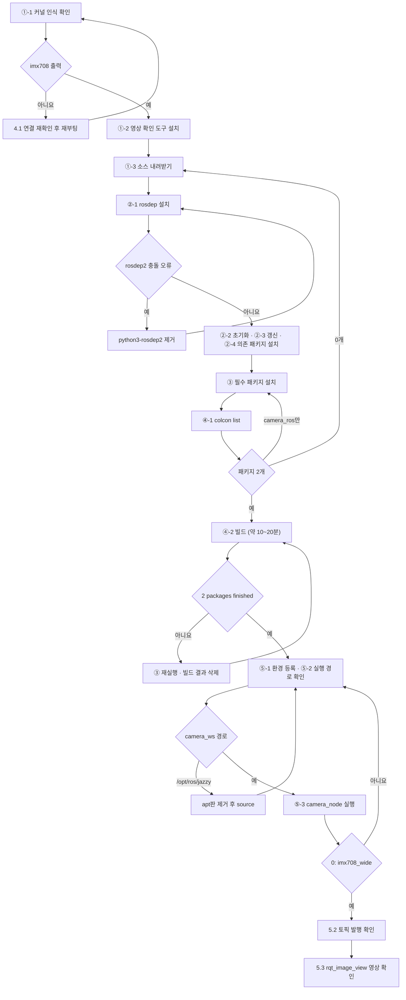

# Day 4 — 카메라와 영상 처리

**2026-09-14 · 한국폴리텍대학교 하이테크과정 ROS2**

이 자료는 수업의 개념 설명과 실습 절차·명령어를 복습용으로 정리한 것입니다. 복습 기준 = 이 자료 + 수업 중 필기.

---

## 목차

1. [오늘의 목표](#1-오늘의-목표)
2. [환경 전환 — PC에서 RPi5로](#2-환경-전환--pc에서-rpi5로)
3. [실습 ① — 원격 연결](#3-실습--원격-연결)
4. [카메라와 이미지 토픽](#4-카메라와-이미지-토픽)
5. [실습 ② — 카메라 노드 구동](#5-실습--카메라-노드-구동)
6. [카메라를 사용할 수 없을 때](#6-카메라를-사용할-수-없을-때)
7. [오늘의 요약](#7-오늘의-요약)
8. [다음 시간](#8-다음-시간)

---

## 1. 오늘의 목표

Day 1~3의 turtlesim은 **좌표가 이미 주어진** 세계였습니다. turtle의 위치는 `/turtle1/pose`로 언제나 정확히 알 수 있었습니다. 실제 로봇에는 그런 토픽이 없습니다. **센서가 전송하는 원본 데이터에서 필요한 정보를 직접 추출해야** 합니다.

| | turtlesim (Day 1~3) | 카메라 (오늘) |
|---|---|---|
| 입력 | `Pose` — x·y·theta가 그대로 | `Image` — 픽셀 값의 배열 |
| 위치 파악 | 구독만으로 확보 | **영상에서 검출** |
| 데이터 크기 | 수십 바이트 | 수십만~수백만 바이트 |
| 오차 | 없음 | 조명·그림자·반사에 따라 변동 |

**오늘 완성할 것** — RPi5에서 **카메라 노드를 구동해 `/camera/image_raw`를 발행**하고, 그 영상을 화면으로 확인합니다. 영상에서 값을 산출하는 처리는 Day 5에서 이어집니다.

| 단계 | 장 | 내용 | 산출물 |
|:--:|:--:|------|------|
| ① 전환 | 2·3 | RPi5 원격 연결 → 환경 확인 | RPi5 작업 환경 |
| ② 카메라 | 4·5 | 이미지 토픽 구조 → 카메라 노드 구동 → 영상 확인 | `/camera/image_raw` 발행 |

- 7장 요약 뒤의 **6장 카메라를 사용할 수 없을 때**는 5.1 소스 빌드 후에도 카메라가 구동되지 않을 때만 실행하는 조건부 절입니다
- **영상 처리·색상 검출·라인 인식은 Day 5에서 다룹니다** — 오늘은 카메라에서 영상이 출력되는 것까지 확인합니다

Day 3까지의 복습:

| 항목 | 내용 |
|------|------|
| 패키지 | `ros2 pkg create --build-type ament_python` → `colcon build` → `source` → `ros2 run` |
| 파라미터 | `declare_parameter` 선언 → `--ros-args -p` 주입 → `param set` 변경 → `dump`로 저장 |
| 커스텀 인터페이스 | `.msg` 직접 정의 — `ament_cmake` 전용 패키지 + `rosidl_generate_interfaces` |
| launch | 여러 노드를 한 명령으로 — `ros2 launch <패키지> <파일>` |
| 미로 자율주행 | 상태 기계(RUN·BACK·TURN)로 벽을 피해 목표에 도달 |

- Day 3까지의 산출물 = `my_first_pkg`(circle_driver·pose_printer·square_driver·maze_driver) + `my_msgs`. **이 작업물은 PC에 그대로 두고**, RPi5에서는 새로 만들어 빌드합니다(3.3)

### 1.1 준비물 확인

| 품목 | 확인 사항 |
|------|----------|
| **Raspberry Pi 5** | **과제 완료 상태** — ① Ubuntu 24.04 + ROS2 Jazzy 구축 ② **SSH(Secure Shell)·원격 데스크톱(RDP, Remote Desktop Protocol) 연결 설정**(Day 3 자료 11장). 상태는 1.2에서 확인 |
| **CSI(Camera Serial Interface) 카메라 모듈** | **Camera Module 3 Wide**(센서 IMX708) · 케이블 = **Camera Cable Standard–Mini 200mm**(RPi5용 22핀↔15핀) · 접점 면 방향 주의 — **전원을 끈 상태에서 연결** |
| 강의실 PC | RPi5 원격 연결 단말(원격 데스크톱·SSH) |
| 유선 랜 또는 Wi-Fi | RPi5와 PC가 **같은 네트워크** |
| microSD·전원 어댑터 | 5V/5A 권장 |

> **자주 하는 실수 —** CSI 케이블은 전원이 켜진 상태에서 꽂으면 모듈이 손상될 수 있습니다. 반드시 전원을 끄고 연결한 뒤 부팅하십시오.

### 1.2 환경 점검 — 시작 전 10분

오늘은 과제 → 연결 → 카메라 → 코드 → 프로젝트가 직렬로 이어지므로, 자신이 어느 단계에 있는지를 가장 먼저 확인합니다. RPi5에서 실행 — Day 3 자료 11.3과 같은 명령입니다.

```bash
lsb_release -a          # Ubuntu 24.04 확인
ros2 --help             # ROS2 명령 인식 확인
echo $ROS_DISTRO        # jazzy 출력 확인
ros2 topic list         # /parameter_events·/rosout 표시
```

| 결과 | 상태 | 다음 |
|------|------|------|
| 4개 모두 정상 | 정상 | 2장으로 진행 |
| `ros2` 명령 미인식 | 경미 | `.bashrc`에 `source /opt/ros/jazzy/setup.bash` 추가(Day 1 자료) — **즉시 복구 가능** |
| Ubuntu 버전 불일치 | 재설치 필요 | 오늘 중 구축 곤란 — 3.1 |
| 부팅 불가 · 미착수 | 미완 | 3.1 |

- 이 과정은 **개인 단위**로 진행합니다 — 기기를 함께 쓰지 않으며, 미완 상태의 진행 방법은 3.1

---

## 2. 환경 전환 — PC에서 RPi5로

### 2.1 왜 오늘부터 RPi5인가

Day 1~3은 강의실 PC의 WSL2에서 진행했습니다. 오늘부터 RPi5로 옮깁니다.

| 이유 | 내용 |
|------|------|
| **카메라** | 이 과정의 카메라는 **CSI 방식**(플랫 케이블) — **RPi 전용 커넥터**라 PC에는 물리적으로 연결되지 않음 |
| 이후 일정 | Day 8~12 실물 구간은 차량에 실린 RPi5에서 동작(Day 7 SLAM 실습만 PC) — 지금 옮겨 두면 전환이 수월함 |
| 성능 확인 | 영상 처리는 연산 부담이 큼 — **RPi5에서 어느 정도 성능으로 실행되는지**를 지금부터 체감해야 Day 9 설계가 현실적이 됨 |

- 두 환경은 **Ubuntu 24.04 + ROS2 Jazzy로 동일** — 코드를 고칠 필요가 없음. 이것이 Day 1에서 버전을 통일한 이유
- 바뀌는 것은 **어디서 실행되는가**뿐

### 2.2 개발 환경과 실행 환경의 분리

실무의 로봇 개발은 대부분 이 구조입니다.

```
개발 PC (코드 작성·빌드) ──git · scp──▶ 로봇 SBC (실행)
        ▲                                    │
        └──────────── 토픽·로그 ──────────────┘
```

| 역할 | 담당 | 이유 |
|------|------|------|
| 코드 작성·편집 | PC 또는 RPi5 | 화면이 크고 입력이 편한 쪽 |
| **실행** | **로봇 위의 컴퓨터** | 센서·구동부가 물리적으로 거기 붙어 있음 |
| 관찰 | 어느 쪽이든 | **같은 네트워크 안이면** 같은 Domain ID로 PC에서도 토픽이 보임(Day 1 자료) — PC가 WSL2이면 기본 설정에서 보이지 않을 수 있음 |

- 오늘은 **RPi5 하나에서 작성·실행을 모두** 수행 — 구조를 단순하게 유지
- SBC(Single Board Computer) = 한 장의 기판에 CPU·메모리·입출력을 모두 갖춘 소형 컴퓨터 — RPi5가 이에 해당

---

## 3. 실습 ① — 원격 연결

### 3.1 환경이 준비되지 않았다면

1.2 점검에서 미완으로 확인된 경우의 진행 방법입니다. 미완 상태라도 각자 아래 경로로 오늘 내용을 학습합니다.

| 상태 | 오늘의 진행 |
|------|------|
| 환경 등록 누락 등 경미 | 즉시 복구 후 정상 경로 |
| 재설치 필요 | **구축을 각자 이어서 진행** — 설치가 진행되는 동안 4장 이론에는 동일하게 참여 |
| 카메라를 구동하지 못함 | **6장의 대체 경로로 진행** — 다른 기기의 영상을 구독하거나 `ros2 bag` 재생·이미지 파일로 대체 |

> **오늘 놓치지 말아야 할 것 —** 카메라가 구동되지 않아도 **Day 5의 영상 처리 원리와 노드 코드는 그대로 학습**할 수 있습니다. 환경은 뒤에 복구하면 되지만, 오늘 다루는 처리 절차(HSV → 마스킹 → 무게중심)는 **Day 5·6의 전제**입니다.

- 구축이 늦어진 경우 **다음 시간 전까지 완료** — Day 5는 RPi5 카메라를 전제로 진행합니다

### 3.2 원격 연결 확인

원격 연결 설정도 과제에 포함되어 있습니다. 여기서는 동작만 확인합니다.

| 방식 | 보이는 것 | 쓰는 상황 |
|------|------|------|
| **SSH** | 터미널만 | 명령 실행·파일 편집 — 가볍고 빠름 |
| **원격 데스크톱(RDP)** | **바탕화면 전체** | **기본 방식** — 카메라 영상 창처럼 **창을 띄우는 프로그램**에 필요 |

- Ubuntu 24.04의 원격 데스크톱 기능은 **RDP 방식** — 강의실 PC(Windows)에 기본 포함된 **원격 데스크톱 연결** 프로그램으로 연결하며 별도 설치가 필요하지 않음
- 같은 역할의 다른 방식으로 VNC(Virtual Network Computing)가 있음 — 이 과정은 Ubuntu 기본값인 RDP를 사용

> **핵심 —** 오늘 다루는 영상 확인 도구(`rqt_image_view`)는 창을 띄웁니다. SSH 터미널만으로는 영상이 보이지 않으므로 원격 데스크톱을 기본으로 합니다.

**확인 ① 원격 데스크톱 연결** — 강의실 PC에서:

```
시작 메뉴 → "원격 데스크톱 연결" 실행 (또는 Win+R → mstsc)
→ 컴퓨터: 192.168.0.__ 입력 → 연결
→ RPi5 원격 데스크톱 설정의 사용자 이름·암호 입력 → RPi5 바탕화면 표시
```

- RPi5 바탕화면이 보이면 → ②로 진행
- 원격 데스크톱을 설정하지 않은 상태면 → 아래 **설정**을 수행한 뒤 **①을 다시** 실행
- 연결 자체가 실패하면 → RPi5 주소(`hostname -I` — 재부팅하면 바뀔 수 있음)·같은 네트워크인지 확인 후 **①을 다시** 실행
- 이름·암호 오류가 나오면 → Ubuntu 계정이 아니라 **원격 데스크톱 설정에 표시된** 이름·암호로 **①을 다시** 실행
- 검은 화면이면 → Windows 기본 `mstsc` 사용·RPi5 로그인 상태·화면 잠금 해제 확인 후 **①을 다시** 실행

**확인 ② SSH 연결**:

```bash
ssh 사용자명@192.168.0.__
```

- 암호 입력 후 RPi5 프롬프트가 나오면 → 3.3으로 진행
- `Connection refused`가 나오면 SSH 서버가 없는 상태 → 아래 **설정**의 SSH 설치를 수행한 뒤 **②를 다시** 실행
- 응답 없이 멈추면 → ①과 같이 주소·네트워크를 확인한 뒤 **②를 다시** 실행

**설정 — 미설정 상태에서만** — 과제 안내(Day 3 자료 11장)의 절차를 지금 수행합니다(약 10분):

```bash
sudo apt install openssh-server -y && sudo systemctl enable --now ssh
hostname -I                       # 주소 확인 — 메모할 것
```

설정(Settings) → 시스템(System) → **원격 데스크톱(Remote Desktop)** → **데스크톱 공유** 켬 + **원격 제어** 켬 → 로그인 정보의 사용자 이름·암호 확인 또는 지정

- 이 이름·암호는 **원격 연결 전용** — Ubuntu 로그인 계정과 별도로 설정됨
- 데스크톱 공유는 **RPi5에서 현재 로그인된 화면**을 PC로 전송하는 방식 — RPi5를 로그인한 상태로 둠
- 설정을 마치면 → 진행하던 **① 또는 ②로 돌아가** 다시 실행

### 3.3 RPi5에서 빌드·실행

**PC의 작업물은 옮기지 않습니다.** RPi5에서 워크스페이스를 새로 만들어 **빌드 흐름만 먼저 확인**합니다.

| 이유 | 내용 |
|------|------|
| 기기 종속 | 빌드 결과물(`build`·`install`)은 생성한 기기에 종속되어 복사해도 사용할 수 없음 |
| **절차 숙달** | 워크스페이스 → 패키지 → 등록 → 빌드는 앞으로 계속 반복하는 절차 |

```bash
mkdir -p ~/ros2_ws/src
cd ~/ros2_ws && colcon build          # build·install·log·src 4폴더 생성 확인
source install/local_setup.bash
```

- 4폴더가 보이면 → 4장으로 진행
- `colcon: command not found`가 나오면 → 아래를 실행한 뒤 **빌드부터 다시** 수행(Day 3 자료 3.0)

```bash
sudo apt install -y python3-colcon-common-extensions ros-dev-tools
```

> **Tip —** `echo "source ~/ros2_ws/install/local_setup.bash" >> ~/.bashrc`를 실행해 두면 새 터미널에서도 자동으로 적용됩니다.

- **노드를 만들어 실행하는 것은 Day 5 자료 3장**에서 `my_car_pkg`로 수행합니다 — 오늘은 카메라를 세우는 것이 목표입니다

---

## 4. 카메라와 이미지 토픽

### 4.1 카메라 연결 방식

| 방식 | 연결 | 이 과정 |
|------|------|:--:|
| **CSI** | 전용 플랫 케이블 — RPi 보드의 카메라 커넥터 | ✅ 사용 |
| USB (UVC, USB Video Class) | USB 포트 — 일반 웹캠 | — |

- CSI는 **RPi 전용 규격** — 전송 대역이 넓고 지연이 짧지만 다른 컴퓨터에 꽂을 수 없음. 이것이 오늘부터 RPi5를 쓰는 이유(2.1)

케이블 규격 확인 — 연결 전에 먼저 확인합니다.

| 구분 | 커넥터 |
|------|------|
| RPi5 보드 | **22핀·0.5mm 간격 소형 커넥터** 2개 — 보드 표시 `CAM/DISP0`·`CAM/DISP1` |
| 카메라 모듈 | 15핀·1mm 간격 표준 커넥터 |
| 필요한 케이블 | **RPi5용 22핀↔15핀 카메라 변환 케이블** — 이 과정 = Camera Cable Standard–Mini 200mm |

- 카메라 모듈에 함께 들어 있는 15핀↔15핀 케이블은 **RPi5에 끼울 수 없음**
- 디스플레이용 케이블과 카메라용 케이블은 서로 바꿔 쓰지 않음
- 연결한 커넥터 번호(`CAM/DISP0` 또는 `CAM/DISP1`)를 기억 — 인식되지 않아 교수에게 알릴 때 함께 전달

연결 절차 — 전원을 끈 상태에서:

1. 카메라 커넥터의 검은 고정 클립을 위로 당김
2. 플랫 케이블의 **접점 면이 보드 안쪽**을 향하도록 삽입
3. 클립을 눌러 고정 → 전원 인가·부팅

인식 확인 — 커널이 카메라를 인식했는지 먼저 확인합니다:

```bash
sudo dmesg | grep -i imx708            # imx708이 보이면 커널이 카메라를 인식한 것
ls /dev/media* /dev/video*             # 카메라 장치 파일 생성 확인
```

- `imx708`(Camera Module 3 Wide의 센서 이름)이 포함된 줄이 나오면 → 4.2로 진행
- 아무것도 나오지 않으면 → 전원을 끄고 연결 절차 1~3(케이블 규격·방향·클립)을 다시 확인 → 부팅 후 **인식 확인을 다시** 실행
- 연결을 다시 확인해도 나오지 않으면 → `/boot/firmware/config.txt`는 직접 편집하지 않고 **교수에게 알림**(편집 후 재부팅에서 터미널이 실행되지 않은 사례가 있음)
- 카메라는 저장 장치가 아니므로 마운트 작업이 없음 — 드라이버가 인식하면 장치 파일이 자동으로 생성됨
- 이 명령은 5.3 **카메라 동작 확인 5단계**의 1단계 — 2단계부터는 5.1 소스 빌드 후 수행

> **자주 하는 실수**
>
> - **15핀 케이블을 RPi5에 끼우려 함** — 규격이 달라 연결되지 않음. 변환 케이블 사용
> - **케이블 방향 반대** — 인식되지 않음. 접점 면 방향을 다시 확인
> - **전원 인가 상태에서 착탈** — 모듈 손상 위험
> - 클립을 덜 눌러 접촉 불량 — 흔들면 인식이 끊김

### 4.2 이미지 토픽의 구조

카메라 노드는 영상을 **토픽으로 발행**합니다. 형식은 `sensor_msgs/msg/Image`입니다.

```bash
ros2 interface show sensor_msgs/msg/Image
```

```
std_msgs/Header header       # 언제·어느 좌표계 (Day 2 자료 Header)
uint32 height                # 세로 픽셀 수
uint32 width                 # 가로 픽셀 수
string encoding              # 픽셀 표현 방식 — 예: rgb8, bgr8
uint8 is_bigendian
uint32 step                  # 한 줄의 바이트 수
uint8[] data                 # ← 픽셀 값 전체 (배열형)
```

| 필드 | 의미 |
|------|------|
| `header` | **Day 2에서 배운 Header** — `stamp`(촬영 시각)·`frame_id`(카메라 좌표계) |
| `height`·`width` | 해상도 |
| `encoding` | 한 픽셀을 어떻게 표현하는가 — `bgr8` = 파랑·초록·빨강 각 8비트 |
| **`data`** | **Day 2의 배열형** — 픽셀 값이 한 줄로 늘어선 형태 |

**크기 계산** — 640×480 컬러 영상 한 장:

```
640 × 480 × 3(BGR) = 921,600 바이트 ≈ 0.9 MB
30Hz로 발행하면 초당 약 27 MB
```

| 토픽 | 한 건 크기 | 비교 |
|------|:--:|------|
| `Twist` (속도 명령) | 48 바이트 | 기준 |
| `Pose` (위치) | 20 바이트 | 더 작음 |
| **`Image` (640×480)** | **약 920,000 바이트** | **약 2만 배** |

- 그래서 이미지 토픽에는 **QoS(Quality of Service) `BEST_EFFORT`**(Day 2 자료)가 기본 — 한 장 놓쳐도 다음 장이 곧 오므로 재전송이 무의미
- `topic echo`로 이미지를 그대로 출력하면 화면이 숫자로 뒤덮이므로 **전용 뷰어**를 씁니다(5.3)

### 4.3 카메라 좌표계 — 부호 반전의 원인

Day 1 표준 좌표계에서 예고한 지점입니다.

| 대상 | 기본 좌표계 |
|------|------|
| 로봇 | x 전방 · y **좌측** · z 상방 |
| 카메라(영상) | **x 우측** · y 하방 · z 전방 |

영상에서 픽셀 위치는 **왼쪽 위가 원점**이고 x는 오른쪽, y는 아래로 증가합니다.

```
(0,0) ────────────► x (오른쪽)
  │
  │      · (320, 240)  ← 화면 중앙
  │
  ▼ y (아래)
```

> **자주 하는 실수 —** 대상이 화면 **오른쪽**에 있으면 영상 좌표 x가 **큽니다.** 그런데 로봇을 그쪽으로 돌리려면 **`angular.z`는 음수**여야 합니다(오른손 법칙 — Day 1). **부호를 뒤집지 않으면 대상에서 멀어지는 방향으로 회전합니다.** 8.2에서 실제로 다룹니다.

---

## 5. 실습 ② — 카메라 노드 구동

진행 흐름 — 확인 결과가 맞지 않으면 화살표를 따라 돌아가 다시 실행합니다.



### 5.1 카메라 스택 설치 — 소스 빌드

RPi5의 CSI 카메라는 **libcamera**라는 라이브러리로 다룹니다. ROS2와 연결하는 패키지가 `camera_ros`입니다.

> **이 과정의 카메라 주의 —** apt로 설치되는 libcamera는 **원본(upstream) 판**입니다. Camera Module 3(IMX708)을 RPi5에서 처리하는 Raspberry Pi 전용 구성 요소가 없어 카메라 노드가 `no cameras available`을 출력합니다. 따라서 **Raspberry Pi판 libcamera와 `camera_ros`를 소스에서 빌드**합니다.

| 구성 | 역할 |
|------|------|
| `raspberrypi/libcamera` | RPi5 카메라 처리 구성 요소를 포함한 libcamera — apt 원본 판을 대신함 |
| `camera_ros` | libcamera 영상을 `/camera/image_raw` 토픽으로 발행 |

설치 순서:

| 순서 | 내용 |
|:--:|------|
| ① 준비 | ①-1 커널 인식 확인 · ①-2 영상 확인 도구 설치 · ①-3 소스 내려받기 |
| ② 의존성 설치 | ②-1 rosdep 설치 · ②-2 초기화 · ②-3 갱신 · ②-4 의존 패키지 설치 |
| ③ 필수 패키지 설치 | libcamera 빌드 도구·라이브러리 설치 |
| ④ 빌드 | ④-1 빌드 대상 확인 · ④-2 빌드(약 10~20분, 실측 10분 38초) |
| ⑤ 빌드 후 확인 | ⑤-1 환경 등록 · ⑤-2 실행 경로 확인 · ⑤-3 카메라 노드 실행 |

- 각 단계는 **실행 → 확인 → 결과에 따른 조치** 순서 — 조치 뒤에 적힌 단계로 돌아가 이어서 진행
- ④-2 빌드가 진행되는 동안 4장 이론을 읽어 둡니다

**①-1 커널 인식 확인**

```bash
sudo dmesg | grep -i imx708
```

- `imx708`이 포함된 줄이 나오면 → ①-2로 진행
- 아무것도 나오지 않으면 → 전원을 끄고 4.1 연결 절차를 다시 확인한 뒤 부팅해 **①-1을 다시** 실행
- 재부팅 후에도 나오지 않으면 → 교수에게 알림

**①-2 영상 확인 도구 설치**

```bash
sudo apt update
sudo apt install -y git ros-jazzy-rqt-image-view ros-jazzy-image-tools
```

- 오류 없이 끝나면 → ①-3으로 진행
- apt판 `ros-jazzy-camera-ros`·`libcamera-tools`는 설치하지 않음(빌드한 판과 혼동 방지) — 이미 설치했다면 아래 명령으로 제거한 뒤 ①-3으로 진행

```bash
sudo apt remove -y ros-jazzy-camera-ros libcamera-tools
```

**①-3 작업 공간 만들기·소스 내려받기**

```bash
source /opt/ros/jazzy/setup.bash
mkdir -p ~/camera_ws/src && cd ~/camera_ws/src
git clone https://github.com/raspberrypi/libcamera.git
git clone https://github.com/christianrauch/camera_ros.git
```

- `ls ~/camera_ws/src`에 `libcamera`·`camera_ros` 두 폴더가 보이면 → ②-1로 진행
- `already exists` 오류가 나오면 이미 내려받은 상태 → ②-1로 진행
- 네트워크 오류로 중단되면 → 연결을 확인하고 **실패한 `git clone` 줄만 다시** 실행
- `~/camera_ws`는 `~/ros2_ws`와 분리한 작업 공간 — 이후 `~/ros2_ws` 빌드 때 libcamera를 다시 빌드하지 않음

**②-1 rosdep 설치**

```bash
sudo apt install -y python3-rosdep
```

- 오류 없이 끝나면 → ②-2로 진행
- `python3-rosdep2`와 충돌한다는 오류가 나오면 → 아래 명령을 실행하고 **②-1을 다시** 실행(수업 중 발생)

```bash
sudo apt remove -y python3-rosdep2
```

- Ubuntu 저장소의 `python3-rosdep2`와 ROS 저장소의 `python3-rosdep`은 함께 설치되지 않음

**②-2 rosdep 초기화** (RPi5마다 최초 1회)

```bash
sudo rosdep init
```

- 완료 메시지가 나오면 → ②-3으로 진행
- `already exists` 오류가 나오면 이미 초기화된 상태 → 그대로 ②-3으로 진행

**②-3 목록 갱신**

```bash
rosdep update
```

- 오류 없이 끝나면 → ②-4로 진행
- 네트워크 오류로 중단되면 → 연결을 확인하고 **②-3을 다시** 실행

**②-4 의존 패키지 설치**

```bash
source /opt/ros/jazzy/setup.bash
cd ~/camera_ws
rosdep install -y --from-paths src --ignore-src --rosdistro jazzy --skip-keys=libcamera
```

- `All required rosdeps installed successfully`가 나오면 → ③으로 진행
- `rosdep: command not found`가 나오면 ②-1이 끝나지 않은 상태 → **②-1부터 다시** 진행
- `--skip-keys=libcamera` = apt의 libcamera를 설치하지 않고 ①-3에서 내려받은 소스를 사용

**③ 필수 패키지 설치** — ② 이후에도 libcamera 빌드 도구는 빠져 있을 수 있어 직접 설치합니다

```bash
sudo apt install -y python3-colcon-meson meson ninja-build pkg-config \
  libyaml-dev python3-yaml python3-ply python3-jinja2 \
  libssl-dev libevent-dev libudev-dev
```

| 패키지 | 용도 |
|------|------|
| `python3-colcon-meson` · `meson` · `ninja-build` · `pkg-config` | 빌드 도구 |
| `libyaml-dev` · `python3-yaml` · `python3-ply` · `python3-jinja2` | libcamera 필수 라이브러리 |
| `libssl-dev` · `libevent-dev` · `libudev-dev` | 모듈 서명 · 이벤트 처리 · 장치 탐지 |

- 오류 없이 끝나면 → ④-1로 진행
- ⚠️ 이 단계를 빠뜨리면 ④-2 빌드가 **수 초 만에 실패**(실측 — libcamera 12.4초)

**④-1 빌드 대상 확인**

```bash
cd ~/camera_ws
colcon list
```

- `camera_ros`·`libcamera` 2개가 나오면 → ④-2로 진행
- 아무것도 나오지 않으면 소스가 없거나 위치가 다른 상태 → **①-3부터 다시** 진행
- `camera_ros`만 나오면 libcamera를 읽는 빌드 도구가 없는 상태 → **③을 다시** 실행하고 ④-1로 돌아옴

**④-2 빌드**

```bash
colcon build --event-handlers=console_direct+
```

- RPi5에서 **약 10~20분**(실측 10분 38초)
- 마지막 줄이 `Summary: 2 packages finished`이면 → ⑤-1로 진행
- `Failed`가 나오면 → **③을 다시** 실행하고, 아래 명령으로 빌드 결과를 지운 뒤 **④-2를 다시** 실행

```bash
cd ~/camera_ws && rm -rf build install log    # 빌드 결과만 삭제 — src는 유지
```

- 같은 실패가 반복되면 → `~/camera_ws/log/latest_build/libcamera/stderr.log` 마지막 부분을 교수에게 전달

**⑤-1 환경 등록**

```bash
echo "source ~/camera_ws/install/setup.bash" >> ~/.bashrc   # 새 터미널에도 적용
source ~/camera_ws/install/setup.bash
```

- 오류 없이 끝나면 → ⑤-2로 진행
- `No such file or directory`가 나오면 빌드가 끝나지 않은 상태 → **④-2로 돌아가** 완료 줄을 확인

**⑤-2 실행 경로 확인**

```bash
ros2 pkg prefix camera_ros
```

- `/home/<사용자>/camera_ws/install/camera_ros`가 나오면 → ⑤-3으로 진행
- `/opt/ros/jazzy`가 나오면 apt판이 실행되는 상태(원본 판 libcamera라 이 카메라를 인식하지 못함) → 아래 명령으로 제거하고 ⑤-1의 `source` 줄을 실행한 뒤 **⑤-2를 다시** 실행

```bash
sudo apt remove -y ros-jazzy-camera-ros
```

- `Package not found`가 나오면 환경 등록이 적용되지 않은 상태 → **⑤-1을 다시** 실행

**⑤-3 카메라 노드 실행**

```bash
ros2 run camera_ros camera_node
```

- 로그에 `0: imx708_wide`가 나오면 → 설치 완료. `Ctrl+C`로 종료하고 5.2로 진행
- `no cameras available`이 나오면 → `Ctrl+C`로 종료하고 **⑤-2를 다시** 실행
- ⑤-2가 `camera_ws` 경로인데도 같은 메시지가 나오면 → `groups` 출력에 `video`가 있는지 확인. 없으면 `sudo usermod -aG video $USER` 실행 후 재로그인하고 **⑤-3을 다시** 실행
- `video`가 있어도 같으면 → **①-1을 다시** 실행해 커널 인식을 확인 → 그래도 같으면 교수에게 알림
- 경고가 여러 줄 섞여 나오는 것은 정상 — 의미는 5.2 실행 로그 읽기

> **여기서 실패하면 이후 진행이 막힙니다 —** 카메라 스택이 구동되지 않으면 오늘 5장 이후와 Day 5 전체가 진행되지 않습니다. 위 조치를 끝까지 수행해도 구동되지 않으면 교수 안내에 따라 **6장 카메라를 사용할 수 없을 때**로 넘어갑니다.

### 5.2 카메라 노드 실행

```bash
ros2 run camera_ros camera_node
```

```bash
# 다른 터미널
ros2 topic list                       # /camera/image_raw 등장 확인
ros2 topic hz /camera/image_raw       # 발행 주기 (Day 1)
ros2 topic bw /camera/image_raw       # 대역폭 — MB 단위가 나옴
```

| 관찰 항목 | 예상 |
|------|------|
| `topic list` | `/camera/image_raw`·`/camera/camera_info` |
| `topic hz` | 약 30Hz(설정에 따라 변동) |
| **`topic bw`** | **수십 MB/s** — 4.2에서 계산한 값과 대조 |

- `topic bw`를 여기서 쓰는 이유 — Day 1에서 명령만 배웠던 것이 **실제로 의미를 갖는 첫 지점**
- 이미지 토픽은 `topic echo`로 출력하지 않음 — 픽셀 값 배열이 화면을 채움
- 해상도를 낮추면 부담이 줄어듦:

```bash
ros2 run camera_ros camera_node --ros-args -p width:=640 -p height:=480
```

- 파라미터 주입 방식은 Day 3 자료 5.4와 동일 — **표준 문법이 그대로 적용됨**

실행 로그 읽기 — 정상 표시와 무시해도 되는 경고:

| 로그 | 의미 |
|------|------|
| `libcamera v0.7.2+rpt…` · `rpi/pisp` | 빌드한 Raspberry Pi판 libcamera 사용 중 — 정상 |
| `cameras: 0: imx708_wide` · `configured with 800x600` | 카메라 인식·설정 완료 — 정상 |
| `no camera / pixel format / dimensions selected` | 파라미터를 주지 않아 기본값으로 시작했다는 안내 |
| `Camera calibration file … not found` | 렌즈 보정 파일 없음 — 영상 출력에는 영향 없음 |
| `No static properties available for 'imx708_wide'` | 센서 부가 정보 안내 — 동작 영향 없음 |
| `AfWindows` · `AF_TRIGGER` · `AF_PAUSE` | 자동초점 설정 미적용 안내 |

### 5.3 영상 확인

```bash
ros2 run rqt_image_view rqt_image_view
```

- 창이 뜨면 좌측 상단에서 `/camera/image_raw` 선택 → 영상 표시
- 원격 데스크톱으로 연결했으므로 이 창이 PC 화면에 보임(3.2)

| 도구 | 용도 |
|------|------|
| `rqt_image_view` | **이미지 토픽 전용 뷰어** — 토픽을 골라 영상으로 표시 |
| `rqt_graph` | 카메라 노드와 구독자의 연결 확인 |
| `topic hz`·`bw` | 수치로 확인 |

> **Tip —** 영상이 끊기거나 지연이 크면 **해상도를 먼저 낮춥니다.** 원격 데스크톱은 화면 전체를 네트워크로 보내므로, 영상 창이 크면 그만큼 느려집니다.

- 확인 지점 — **카메라 → 토픽 → 뷰어**의 경로가 성립. 이 사이에 직접 만든 노드를 넣는 것이 **Day 5**

**카메라 동작 확인 — 5단계**

앞 단계가 성립해야 다음 단계로 넘어갑니다. 정상이 아니면 "아니면" 열의 조치를 실행하고 적힌 단계부터 다시 확인합니다.

| 단계 | 명령 | 정상 | 아니면 |
|:--:|------|------|------|
| 1 커널 인식 | `sudo dmesg \| grep -i imx708` | `imx708` 출력 | 5.1 ①-1 조치 → 1 다시 |
| 2 스택 빌드 | `ros2 pkg prefix camera_ros` | `camera_ws` 경로 | 5.1 ⑤-2 조치 → 2 다시 |
| 3 ROS 카메라 | `ros2 run camera_ros camera_node` | `0: imx708_wide` | 2부터 다시 |
| 4 토픽 발행 | `ros2 topic hz /camera/image_raw` | 약 30Hz | 4 조치(아래) → 4 다시 |
| 5 최종 검증 | `rqt_image_view` → `/camera/image_raw` | 영상·움직임 반영 | 5 조치(아래) → 5 다시 |

- 4 조치 = 3의 노드가 실행 중인지 확인 · 두 터미널의 `echo $ROS_DOMAIN_ID` 값이 같은지 확인
- 5 조치 = SSH가 아닌 원격 데스크톱 화면에서 실행했는지(3.2) · 좌측 상단에서 `/camera/image_raw`를 선택했는지 확인 · 영상이 끊기거나 느리면 해상도를 640×480으로 낮춤(5.2)

---

## 6. 카메라를 사용할 수 없을 때

4.1·5.1의 조치를 끝까지 수행해도 카메라가 구동되지 않아 **교수가 전환을 안내한 경우**에 사용합니다. 실패에 대비해 별도 경로를 준비해 두는 같은 방식을 Day 8 결선·Day 9 실물 전환에서도 사용합니다.

카메라 없이 실습하는 방법 — 카메라가 구동되지 않은 학생도 Day 5의 영상 처리 실습을 진행합니다.

| 경로 | 방법 |
|:--:|------|
| ⓐ **다른 기기의 영상 구독** | 카메라가 정상인 학생의 기기에서 **카메라 노드만** 실행 → **같은 공유기·같은 `ROS_DOMAIN_ID`면 자기 RPi5에서 그 토픽을 구독**(Day 1). 기기를 공용으로 쓰는 것이 아니라 **각자 자기 노드를 자기 기기에서 작성·실행** |
| ⓑ **저장 영상** | 미리 기록한 `ros2 bag`을 재생(9.1) — 카메라 없이 `/camera/image_raw`가 발행됨 |
| ⓒ 이미지 파일 | OpenCV로 정지 영상을 읽어 처리 — ROS2 없이 Day 5 개념만 확인 |

- **ⓐ가 가장 권장** — **같은 네트워크 안에서는 노드가 여러 기기에 흩어져도 같은 도메인이면 연결된다**는 것의 실증이며, 오늘 배운 내용이 그대로 쓰임
- ⓐ는 RPi5끼리 구독하는 방식 — 강의실 PC의 WSL2에서 구독하면 기본 설정에서는 토픽이 보이지 않을 수 있음

### 6.1 영상 저장과 재생 — 방법 ⓑ

카메라 없이 `/camera/image_raw`를 발행하려면 미리 기록한 파일을 재생합니다.

```bash
ros2 bag record /camera/image_raw -o run1      # 기록 (카메라가 정상인 기기에서 — Day 2 자료 bag)
ros2 bag play run1                              # 재생 — 카메라 없이 토픽 발행
```

- 이미지 토픽은 용량이 크므로 **짧게** 기록 — 30초면 수백 MB
- 재생 중에는 카메라 노드를 끄고 진행(같은 토픽에 발행자가 둘이 되지 않도록)
- 활용 — **Day 5 자료 14.1의 학습 데이터 수집** · 조명 조건별 데이터 비교

---

## 7. 오늘의 요약

| 항목 | 내용 |
|------|------|
| 환경 전환 | **오늘부터 RPi5** — 카메라가 CSI 방식이라 PC에 연결되지 않음. 원격 데스크톱·SSH로 연결 |
| 카메라 연결 | Camera Module 3 Wide를 CSI 연결 — **전원 차단 상태에서** 작업 |
| 카메라 스택 | Raspberry Pi판 `libcamera` 소스 빌드 → `camera_ros` → `/camera/image_raw` 발행 |
| 이미지 토픽 | `sensor_msgs/msg/Image` — Header + **배열형 `data`**. 640×480 컬러 ≈ **0.9MB/장**, `Twist`의 약 2만 배 |
| 좌표계 | **영상 x는 오른쪽(+) / 로봇 회전 양수는 반시계** — **부호 반전 필수** |
| 확인 | `rqt_image_view`로 영상 표시까지 확인 — 카메라에서 토픽까지의 경로가 성립 |
| 작업 방식 | PC의 작업물은 옮기지 않음 — RPi5에서 **새 패키지로 다시 작성**(Day 5 자료 3장) |

---

## 8. 다음 시간

**Day 5 — AI 이미지 분류** (9/21)

- **영상 처리와 AI 분류** — 오늘 확인한 영상에서 좌표를 산출하고(색상 검출), 학습 모델로 표지판의 종류를 구분합니다
- Teachable Machine으로 학습 → TFLite(TensorFlow Lite) 형식으로 배포 → RPi5에서 추론
- 각자 표지판을 촬영해 학습 데이터를 만듭니다 — **RPi5 카메라가 동작하는 상태**로 참석합니다
- 카메라를 끝내 구동하지 못했으면 6장의 방법으로 영상을 확보한 뒤 참석합니다
